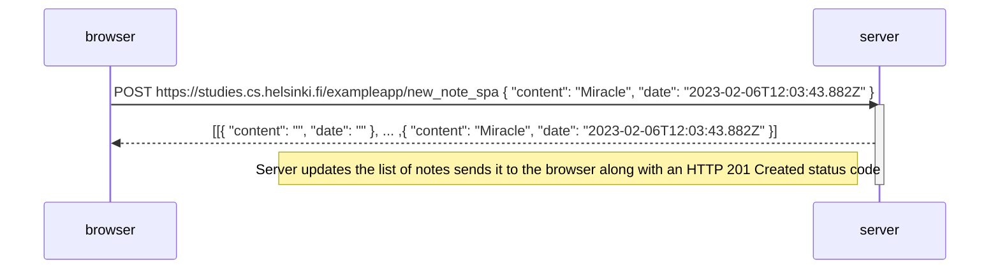

```mermaid
sequenceDiagram
    participant browser
    participant server
    
    browser->>server: POST https://studies.cs.helsinki.fi/exampleapp/new_note_spa { "content": "Miracle", "date": "2023-02-06T12:03:43.882Z" }
    activate server
    server-->>browser: [[{ "content": "", "date": "" }, ... ,{ "content": "Miracle", "date": "2023-02-06T12:03:43.882Z" }]
    Note left of server: Server updates the list of notes sends it to the browser along with an HTTP 201 Created status code
    deactivate server
```
